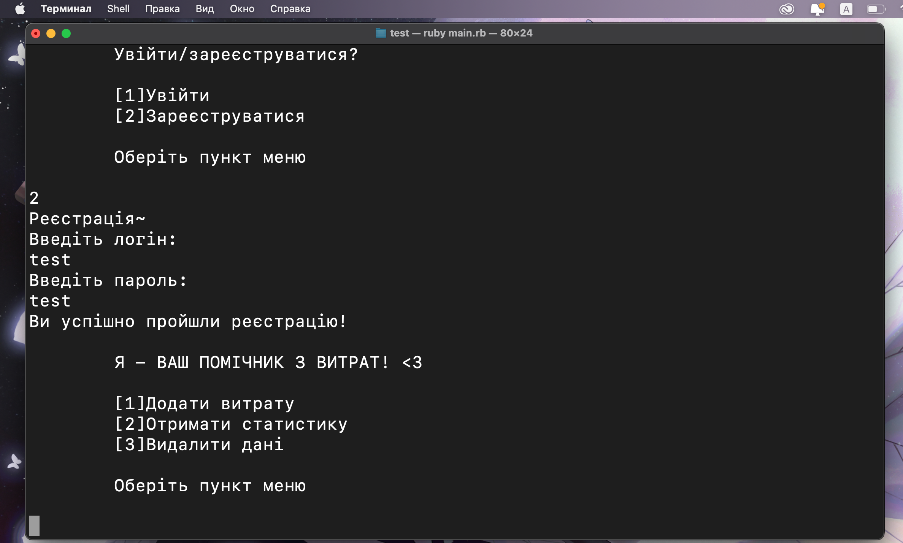

# ДОДАТОК КОНТРОЛЮ ВИТРАТ
## Запуск
Знаходячись в папці з додатком, ввести команду
```
ruby main.rb
```

> Повинна з'явитися авторизація

Вводячи в консоль числа "1, 2, 3..." можна переміщатися по функціям програми

Після проходження авторизації, відкривається меню програми.

> Меню

## Функції програми
В прогрмі є 3 функіції: додавання до бд витрат користувача, показ статистики за критеріями, видалення всіх данних витрат користувача.

###### Додавання витрат
Додати витрати можна за сьогодні, вчора, а також за будь-яку іншу дату. Вибрати з наявності категорію витрат та додати суму витрати.
Після чого дані вносяться до бд.

###### Показ статистики
Статистику можна відобразити за всіма категоріями чи за одною, також можна відобразити статистику за певний період, а саме - за день, місяць та рік.

###### Видалення данних
Вибираючи 3 пункт меню, видаляються всі дані витрат із бд користувача, який авторизован у програмі.
